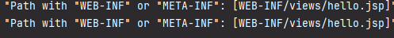

문제: jsp 파일을 찾을 수 없음<br>
원인: 내장된 tomcat에 jsp를 처리하는 서블릿이 없음<br>
해결: build.gradle이나 pom.xml 등에 jsp 처리하는 서블릿을 추가해주고 refresh


Maven 기준
```xml
<dependency>
	<groupId>org.apache.tomcat.embed</groupId>
	<artifactId>tomcat-embed-jasper</artifactId>
</dependency>
```
img

문제: jsp파일 내 정적 리소스파일을 찾지 못하여 이미지가 깨지는 현상<br>
원인: ~~정적리소스 파일 경로가 webapp 하위 경로로 지정되어 있지않아 파일을 찾지 못함<br> 
해결: application.properties에 static-locations을 지정해준다.<br>
```html
<div id="warp">
        <h1></h1>
</div>
```

문제: jsp파일 내에서 window.open함수를 사용해서 페이지 이동 시키려고 하는데 whiteblank페이지가 나옴<br>
원인: 도메인이 없는 상태에서 페이지 이동을하려고 하는 경우 mapping이 되어있어야 함<br>
해결: Controller에서 이동용 Getmapping을 생성<br>

